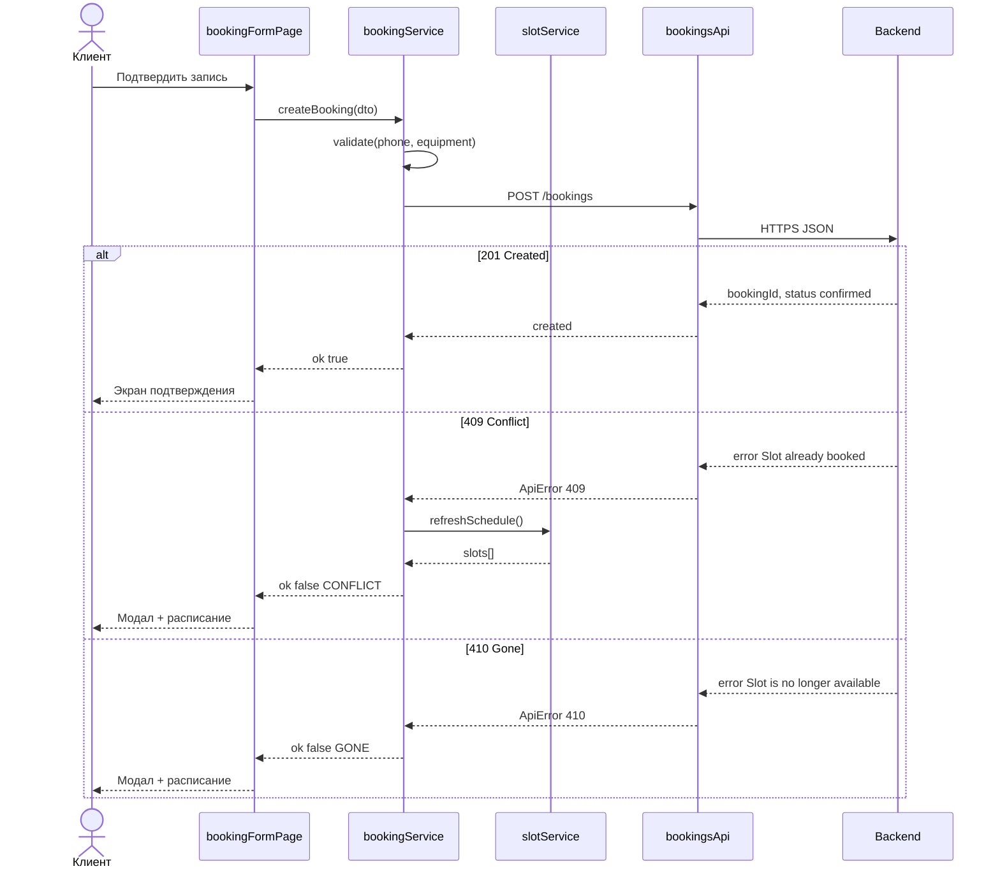

# Архитектура — клиентское мобильное веб-приложение «Кулинарная студия» (Vanilla JS)

> **Основа:** `domain_model.md`, `requirements.md`, `docs/brief-cooking.md`  
> **Стек:** HTML5, CSS3 (mobile-first), ES Modules, без UI-фреймворков  
> **Принцип:** бэкенд — единственный источник истины (R-004, R-015); клиент — тонкий SPA-потребитель API

---

## 1. Архитектурный паттерн

### 1.1. Общая схема: модульный SPA с тремя слоями

Приложение строится как **Single Page Application** с **hash-роутингом** (`#/…`). Перезагрузка страницы не требуется при навигации между экранами. Состояние сессии (номер телефона клиента) хранится в памяти приложения и при необходимости дублируется в `sessionStorage` — **без токенов авторизации** в MVP контракта `POST /bookings` (идентификация через поле `phone` в теле запроса).

```
┌─────────────────────────────────────────────────────────────────┐
│                        Browser (Mobile Web)                      │
├─────────────────────────────────────────────────────────────────┤
│  UI Layer                                                        │
│  pages/* · components/* · render-функции · обработчики событий   │
├─────────────────────────────────────────────────────────────────┤
│  Business Logic Layer (Services / Use Cases)                     │
│  slotService · bookingService · sessionService · ratingService   │
│  — валидация форм, UI-правила (дедлайн отмены), оркестрация      │
├─────────────────────────────────────────────────────────────────┤
│  API Client Layer                                                │
│  httpClient · slotsApi · bookingsApi · profileApi                │
│  — fetch(), JSON, маппинг HTTP-кодов → доменные ошибки           │
└────────────────────────────┬────────────────────────────────────┘
                             │ HTTPS
                             ▼
                    Backend API (black-box)
```

**Правило зависимостей (строго однонаправленно):**

| Слой | Может импортировать | Не может импортировать |
|------|---------------------|-------------------------|
| **UI** | Services, utils, components | API Client напрямую (только через Services) |
| **Services** | API Client, utils, types | UI, DOM |
| **API Client** | utils (config) | Services, UI |

**Поток данных при действии пользователя:**

1. UI ловит событие (click, submit).
2. UI вызывает метод **Service** (use case).
3. Service выполняет клиентскую валидацию и вызывает **API Client**.
4. API Client делает `fetch`, возвращает типизированный результат или `ApiError`.
5. Service интерпретирует ответ (201 / 409 / 410) и возвращает **ViewModel** для UI.
6. UI вызывает **render-функцию** и монтирует HTML в `#app`.

---

### 1.2. Структура каталогов проекта

```
cooking-client/
├── index.html                 # точка входа, <div id="app">, подключение main.js (type=module)
├── manifest.webmanifest       # PWA-lite (NFR-006)
├── css/
│   ├── reset.css
│   ├── tokens.css             # CSS-переменные (отступы, цвета, min tap 44px)
│   └── app.css                # mobile-first layout
├── src/
│   ├── main.js                # bootstrap: router.init(), online/offline banner
│   ├── config.js              # API_BASE_URL, константы (CANCEL_DEADLINE_HOURS=2)
│   │
│   ├── router/
│   │   ├── router.js          # hashchange listener, dispatch
│   │   └── routes.js          # таблица маршрутов → page factory
│   │
│   ├── api/
│   │   ├── httpClient.js      # request(method, path, body), ApiError class
│   │   ├── slotsApi.js        # getSlots(dateFrom, dateTo), getSlotById(id)
│   │   ├── bookingsApi.js     # createBooking(dto), cancelBooking(id), getMyBookings(phone)
│   │   └── profileApi.js      # getStudioContacts()
│   │
│   ├── services/
│   │   ├── sessionService.js  # phone in memory/sessionStorage
│   │   ├── slotService.js     # loadSchedule, loadSlotDetail, refresh after conflict
│   │   ├── bookingService.js  # createBooking use case, cancelBooking, canCancel()
│   │   └── ratingService.js   # submitRating (P1)
│   │
│   ├── pages/
│   │   ├── loginPage.js
│   │   ├── schedulePage.js    # список слотов (FR-010)
│   │   ├── slotDetailPage.js
│   │   ├── bookingFormPage.js
│   │   ├── bookingConfirmPage.js
│   │   ├── myBookingsPage.js
│   │   ├── bookingDetailPage.js
│   │   └── contactsPage.js
│   │
│   ├── components/
│   │   ├── layout.js          # header, bottom nav
│   │   ├── slotCard.js
│   │   ├── bookingCard.js
│   │   ├── equipmentPicker.js
│   │   ├── emptyState.js
│   │   ├── loader.js
│   │   ├── modal.js
│   │   └── toast.js
│   │
│   ├── models/
│   │   └── types.js             # JSDoc typedefs (Slot, Booking, …)
│   │
│   └── utils/
│       ├── dates.js             # formatDateTime (без TZ-конвертации — FR-017)
│       ├── phone.js             # normalizePhone
│       └── network.js           # isOnline()
└── api/
    └── openapi.yaml             # контракт (источник истины для API Client)
```

---

### 1.3. UI Layer — компоненты и render-функции

**Паттерн:** «функциональный UI» без Virtual DOM. Каждый модуль экспортирует:

- `renderX(props) → string` — чистая функция, возвращает HTML-строку;
- `mountX(container, props)` — optional: навешивает делегированные обработчики через `container.addEventListener`.

**Страница (Page)** — orchestrator UI:

```javascript
// pages/bookingFormPage.js (эскиз)
export async function showBookingFormPage(router, slotId) {
  const slot = await slotService.getSlotById(slotId);
  const phone = sessionService.getPhone();
  router.setContent(renderBookingForm({ slot, phone }));

  router.onSubmit('#booking-form', async (formData) => {
    const result = await bookingService.createBooking({ slotId, ...formData, phone });
    if (result.ok) router.navigate(`/bookings/confirm/${result.bookingId}`);
    else router.showModal(result.errorMessage);
  });
}
```

**Компоненты** — переиспользуемые фрагменты (`slotCard`, `equipmentPicker`, `emptyState`).  
**Layout** — фиксированная нижняя навигация: «Расписание» | «Мои записи» | «Контакты».

**UI не содержит:**

- прямых вызовов `fetch`;
- бизнес-правил вида «можно ли отменить» (только отображает результат `bookingService.canCancel()`).

---

### 1.4. Business Logic Layer — сервисы / use cases

| Service | Ответственность | Связанные FR |
|---------|-----------------|--------------|
| `sessionService` | Хранение `phone`, проверка «вошёл ли клиент», redirect на login | FR-001 |
| `slotService` | Загрузка расписания (7 дней по умолчанию), детали слота, refresh после 409 | FR-010–FR-017, FR-026 |
| `bookingService` | **createBooking**, cancelBooking, список «мои брони», UI-правило T−2ч для отмены | FR-020–FR-037 |
| `ratingService` | Отправка оценки 1–5, проверка окна 7 дней | FR-040–FR-044 |

**Пример use case `bookingService.createBooking`:**

```javascript
// services/bookingService.js (эскиз)
export async function createBooking({ slotId, phone, equipmentType, allergies }) {
  // 1. Клиентская пре-валидация (UI-подсказка, не authoritative)
  if (!phone) return { ok: false, errorMessage: 'Укажите номер телефона' };
  if (!equipmentType) return { ok: false, errorMessage: 'Выберите экипировку' };

  // 2. Вызов API
  try {
    const dto = {
      slotId,
      phone: normalizePhone(phone),
      equipmentOptions: { type: equipmentType }, // own | rental
      allergies: allergies ?? '',
    };
    const created = await bookingsApi.createBooking(dto);
    return { ok: true, bookingId: created.bookingId, status: created.status };
  } catch (err) {
    if (err.status === 409) {
      await slotService.refreshSchedule(); // FR-026
      return { ok: false, code: 'CONFLICT', errorMessage: 'Места только что закончились' };
    }
    if (err.status === 410) {
      return { ok: false, code: 'GONE', errorMessage: 'Этот класс больше недоступен для записи' };
    }
    throw err;
  }
}
```

**Authoritative-правила** (0 мест, слот отменён студией, двойная бронь) — **только на бэкенде** (R-004). Service лишь маппит коды ответа на UX.

---

### 1.5. API Client Layer — асинхронные HTTP-запросы

**`httpClient.js`** — единая точка `fetch`:

```javascript
export class ApiError extends Error {
  constructor(status, body) {
    super(body?.error ?? `HTTP ${status}`);
    this.status = status;
    this.body = body;
  }
}

export async function request(method, path, body) {
  const headers = { 'Content-Type': 'application/json' };
  const res = await fetch(`${API_BASE_URL}${path}`, {
    method,
    headers,
    body: body ? JSON.stringify(body) : undefined,
  });
  const data = res.headers.get('content-type')?.includes('json')
    ? await res.json()
    : null;
  if (!res.ok) throw new ApiError(res.status, data);
  return data;
}
```

**`bookingsApi.createBooking`** — thin wrapper над `POST /bookings` (см. OpenAPI).

**Без заголовков авторизации** — идентификация клиента через `phone` в теле запроса (контракт Block 5).

---

### 1.6. Hash-роутинг

**Механизм:** `window.location.hash` + событие `hashchange`. Без сторонних библиотек.

**Таблица маршрутов (`routes.js`):**

| Hash-паттерн | Page | Описание |
|--------------|------|----------|
| `#/` или `#/schedule` | `schedulePage` | Список слотов (7 дней) |
| `#/slots/:slotId` | `slotDetailPage` | Детали слота |
| `#/slots/:slotId/book` | `bookingFormPage` | Форма бронирования |
| `#/bookings/confirm/:bookingId` | `bookingConfirmPage` | Подтверждение (FR-025) |
| `#/bookings` | `myBookingsPage` | Мои записи |
| `#/bookings/:bookingId` | `bookingDetailPage` | Детали брони |
| `#/login` | `loginPage` | Ввод телефона |
| `#/contacts` | `contactsPage` | Контакты студии |

**`router.js` (алгоритм):**

1. `init()` — подписаться на `hashchange` и `load` → `resolveRoute()`.
2. `resolveRoute()` — распарсить hash (`#/slots/abc123/book` → `{ name: 'bookingForm', params: { slotId: 'abc123' } }`).
3. **Guard:** если маршрут требует `phone` и его нет в `sessionService` → redirect `#/login?next=<encoded-hash>`.
4. Вызвать `page.show(router, params)` — async, с loader (NFR-002).
5. `navigate(path)` — `location.hash = path`.

**Deep link для push (R-008):** `#/bookings/{bookingId}` — тот же роутер, без перезагрузки.

---

## 2. Client-side Data Model

> Типы описаны в JSDoc (`models/types.js`). Клиент **не является** source of truth: после мутаций данные перечитываются с API или берутся из ответа `POST`.

### 2.1. Slot

| Атрибут | Тип | Источник |
|---------|-----|----------|
| `id` | `string` | Только чтение (API) |
| `startsAt` | `string` (ISO 8601) | Только чтение |
| `durationMinutes` | `number` | Только чтение |
| `programTitle` | `string` | Только чтение |
| `menuSummary` | `string` | Только чтение |
| `chef` | `Chef` | Только чтение |
| `availableSeats` | `number` | Только чтение |
| `capacity` | `number` | Только чтение |
| `studioAddress` | `string` | Только чтение |
| `rentalPrice` | `number` | Только чтение |
| `freeRentalStock` | `number` | Только чтение |
| `cancelledByStudio` | `boolean` | Только чтение (если true — не показывать в расписании, FR-015) |

**Пример JSON (ответ API, элемент `GET /slots`):**

```json
{
  "id": "slot_20260710_1800_pasta",
  "startsAt": "2026-07-10T18:00:00+03:00",
  "durationMinutes": 180,
  "programTitle": "Итальянская кухня для новичков",
  "menuSummary": "Паста, соус песто, тирамisu",
  "chef": {
    "id": "chef_marco",
    "name": "Марко"
  },
  "availableSeats": 3,
  "capacity": 8,
  "studioAddress": "г. Москва, ул. Заводская, 12",
  "rentalPrice": 500,
  "freeRentalStock": 2,
  "cancelledByStudio": false
}
```

---

### 2.2. Booking

| Атрибут | Тип | Источник |
|---------|-----|----------|
| `id` | `string` | Чтение после создания / `GET /bookings/mine` |
| `slotId` | `string` | Мутация (create) + чтение |
| `phone` | `string` | Мутация (create) — идентификация клиента |
| `status` | `BookingStatus` | Чтение (обновляется бэкендом) |
| `equipmentOptions` | `{ type: 'own' \| 'rental' }` | Мутация (create) |
| `allergies` | `string` | Мутация (create, optional) |
| `cancellationReason` | `string \| null` | Только чтение (при `cancelled_by_studio`) |
| `slot` | `Slot` (embedded) | Только чтение (в деталях брони) |
| `rating` | `number \| null` | Мутация через отдельный endpoint (P1) |

**`BookingStatus` (enum на клиенте, маппинг UI-подписей FR-031):**

| API value | UI (RU) |
|-----------|---------|
| `confirmed` | Активна |
| `completed` | Завершена |
| `cancelled_by_client` | Отменена клиентом |
| `cancelled_by_studio` | Отменён студией |

**Пример JSON (ответ `POST /bookings` 201 — минимальный контракт Block 5):**

```json
{
  "bookingId": "bk_8f3a2c1",
  "status": "confirmed"
}
```

**Пример JSON (элемент `GET /bookings/mine` — расширенное представление для UI):**

```json
{
  "id": "bk_8f3a2c1",
  "slotId": "slot_20260710_1800_pasta",
  "phone": "+79001234567",
  "status": "confirmed",
  "equipmentOptions": { "type": "rental" },
  "allergies": "Орехи",
  "cancellationReason": null,
  "slot": {
    "id": "slot_20260710_1800_pasta",
    "startsAt": "2026-07-10T18:00:00+03:00",
    "durationMinutes": 180,
    "programTitle": "Итальянская кухня для новичков",
    "menuSummary": "Паста, соус пестo, тирамisu",
    "chef": { "id": "chef_marco", "name": "Марко" },
    "availableSeats": 2,
    "capacity": 8,
    "studioAddress": "г. Москва, ул. Заводская, 12",
    "rentalPrice": 500,
    "freeRentalStock": 1,
    "cancelledByStudio": false
  },
  "rating": null
}
```

---

### 2.3. Прочие сущности (кратко)

| Сущность | Ключевые атрибуты | Операция на клиенте |
|----------|-------------------|---------------------|
| **Program** | `id`, `title`, `menuSummary` | Только чтение (вложена в Slot) |
| **Chef** | `id`, `name` | Только чтение (вложен в Slot) |
| **ClientSession** | `phone: string` | Мутация локально (`sessionService`) |
| **StudioContacts** | `phone`, `address`, `whatsappUrl?` | Только чтение (API) |
| **ChefRating** | `bookingId`, `score: 1..5` | Мутация (`POST /bookings/{id}/rating`, P1) |

---

## 3. Диаграмма взаимодействия: `createBooking`

**Use case:** UC-002, UC-008 | **FR:** FR-020–FR-026 | **Entry point:** `bookingService.createBooking()`

### 3.1. Участники

```
[Клиент] → [bookingFormPage UI] → [bookingService] → [bookingsApi] → [httpClient] → [Backend POST /bookings]
                ↑                           │
                └──── slotService.refreshSchedule() ←── (только при 409)
```

### 3.2. Общий поток (до разветвления)

| # | Откуда | Куда | Действие |
|---|--------|------|----------|
| 1 | Клиент | UI | Нажимает «Подтвердить запись» на `#/slots/:id/book` |
| 2 | UI | UI | Собирает: `slotId`, `phone` (из session), `equipmentOptions.type`, `allergies` |
| 3 | UI | bookingService | `createBooking({ slotId, phone, equipmentType, allergies })` |
| 4 | bookingService | bookingService | Пре-валидация: phone не пуст, equipment выбран |
| 5 | bookingService | bookingsApi | `createBooking({ slotId, phone, equipmentOptions, allergies })` |
| 6 | bookingsApi | httpClient | `POST /bookings`, body JSON, header `Content-Type: application/json` |
| 7 | httpClient | Backend | HTTPS-запрос |

---

### 3.3. Ветка A — **201 Created** (успех)

**Условие:** слот доступен, место есть, прокат (если выбран) зарезервирован на бэкенде.

| # | Откуда | Куда | Действие |
|---|--------|------|----------|
| 8a | Backend | httpClient | `201`, body: `{ "bookingId": "bk_…", "status": "confirmed" }` |
| 9a | httpClient | bookingsApi | return parsed JSON |
| 10a | bookingsApi | bookingService | return `{ bookingId, status: 'confirmed' }` |
| 11a | bookingService | UI | return `{ ok: true, bookingId, status }` |
| 12a | UI | UI | `router.navigate('#/bookings/confirm/' + bookingId)` |
| 13a | UI | Клиент | Экран подтверждения: программа, дата, шеф, экипировка, адрес, текст об оплате (FR-025) |

**Постусловия:** бронь создана на бэкенде; `availableSeats` уменьшен (клиент увидит при следующем `GET /slots`).

---

### 3.4. Ветка B — **409 Conflict** (`Slot already booked`)

**Условие:** атомарная проверка на бэкенде не прошла — **мест нет** или **клиент с этим phone уже забронировал этот слот** (R-004).

| # | Откуда | Куда | Действие |
|---|--------|------|----------|
| 8b | Backend | httpClient | `409`, body: `{ "error": "Slot already booked" }` |
| 9b | httpClient | bookingsApi | throw `ApiError(409, body)` |
| 10b | bookingsApi | bookingService | catch `ApiError` |
| 11b | bookingService | slotService | `refreshSchedule()` → `GET /slots?dateFrom&dateTo` (FR-026) |
| 12b | slotService | bookingService | обновлённый список слотов |
| 13b | bookingService | UI | return `{ ok: false, code: 'CONFLICT', errorMessage: 'Места только что закончились' }` |
| 14b | UI | Клиент | Модал с текстом ошибки + кнопка «К расписанию» |
| 15b | UI | router | `navigate('#/schedule')` — слот отображается с `availableSeats: 0` или исчез из списка |

**Постусловия:** бронь **не** создана; UI синхронизирован с бэкендом.

---

### 3.5. Ветка C — **410 Gone** (`Slot is no longer available`)

**Условие:** слот **отменён студией**, время старта прошло, или слот снят с публикации (R-008, FR-015, FR-027).

| # | Откуда | Куда | Действие |
|---|--------|------|----------|
| 8c | Backend | httpClient | `410`, body: `{ "error": "Slot is no longer available" }` |
| 9c | httpClient | bookingsApi | throw `ApiError(410, body)` |
| 10c | bookingsApi | bookingService | catch `ApiError` |
| 11c | bookingService | UI | return `{ ok: false, code: 'GONE', errorMessage: 'Этот класс больше недоступен для записи' }` |
| 12c | UI | Клиент | Модал с пояснением; CTA «Выбрать другой класс» |
| 13c | UI | router | `navigate('#/schedule')` |

**Постусловия:** бронь **не** создана; клиент направлен к актуальному расписанию.

---

### 3.6. Сводная таблица веток

| HTTP | `error` (body) | Действие Service | Действие UI |
|------|----------------|------------------|-------------|
| **201** | — | `{ ok: true, bookingId, status }` | Экран подтверждения |
| **409** | `Slot already booked` | refresh slots + `{ ok: false, code: 'CONFLICT' }` | Модал «Места закончились» → расписание |
| **410** | `Slot is no longer available` | `{ ok: false, code: 'GONE' }` | Модал «Класс недоступен» → расписание |

---

### 3.7. Sequence diagram (Mermaid)



---

**Согласование с требованиями:** слой Services маппит `status: "confirmed"` на UI-подпись «Активна» (FR-031); коды 409/410 закрывают FR-026, FR-027 и R-004/R-008. OpenAPI (`api/openapi.yaml`) описывает `POST /bookings` — остальные endpoints (`GET /slots`, `GET /bookings/mine` и др.) добавляются отдельными итерациями контракта (FR-074).
